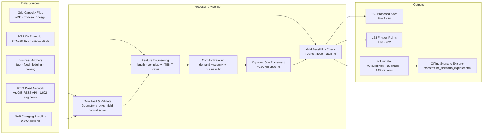
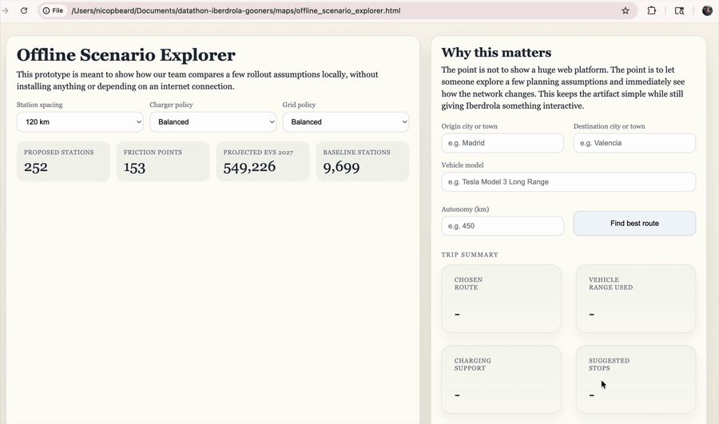

# IE Sustainability Datathon March 2026

## Project: Data-Driven EV Infrastructure Planning for Spain's RTIG Road Network

Comprehensive analysis of Spain's strategic road network (RTIG) to identify optimal locations for EV charging infrastructure, renewable energy distribution, and transport sustainability initiatives.

---

## 📋 Quick Start (5 minutes)

### Prerequisites
- Python 3.11+
- conda
- pip (optional secondary path)
- Git

### Setup & Run

```bash
# 1. Clone and navigate
cd /path/to/datathon-iberdrola-gooners

# 2. Create environment
conda env create -f environment.yml
conda activate iberdrola-datathon

# 3. Install dependencies
# already handled by environment.yml

# 4. Run full pipeline
PYTHONPATH=. python scripts/run_pipeline.py

# 5. Open Jupyter notebooks (analysis, models, dashboards)
jupyter notebook notebooks/
```

### Pip Alternative

If you prefer a lighter local setup, you can still use `venv` and `pip` instead:

```bash
python -m venv .venv
source .venv/bin/activate
pip install -r requirements.txt
PYTHONPATH=. python scripts/run_pipeline.py
```

If you already created the Conda environment before the latest dependency changes, update it with:

```bash
conda env update -f environment.yml --prune
conda activate iberdrola-datathon
```

**✓ Complete pipeline runs in < 2 minutes**

### Datathon Submission Outputs

```bash
PYTHONPATH=. python scripts/run_pipeline.py
python scripts/fetch_external_data.py
python scripts/generate_submission_package.py
python scripts/validate_submission.py
python scripts/scrub_notebook_paths.py
```

This produces the competition CSVs in `data/submission/`, caches the official external inputs in `data/external/`, and rebuilds the proposal map in `maps/proposed_charging_network.html`.

At the time of writing, the validated submission package contains:
- `269` proposed charging locations
- `9,699` existing baseline stations matched from the official NAP source
- `145` friction points
- `549,226` projected EV stock proxy in the 2027 scenario

For the strongest offline demo artifact, also build:

```bash
python scripts/build_offline_scenario_explorer.py
```

This creates `maps/offline_scenario_explorer.html`, a self-contained local scenario explorer with no external tile or web dependencies.
The default BI artifact `maps/proposed_charging_network.html` is also generated as a self-contained offline HTML file.

If you want to remove machine-specific absolute paths from saved notebook outputs before sharing the repo, run:

```bash
python scripts/scrub_notebook_paths.py
```

---

## 📁 Project Structure

```
├── README.md                          # This file
├── environment.yml                    # Default Conda environment
├── requirements.txt                   # Secondary pip dependencies
├── config/
│   └── settings.yaml                 # API & dataset configuration
├── scripts/
│   ├── run_pipeline.py               # Main data pipeline (download → preprocess)
│   └── build_report.py               # Generate analysis report
├── src/
│   └── data/
│       ├── download.py               # ArcGIS REST API client with pagination
│       ├── preprocess.py             # Data cleaning & feature engineering
│       └── eda.py                    # Exploratory data analysis utilities
├── notebooks/
│   ├── 01_eda.ipynb                  # Exploratory Data Analysis
│   ├── 02_feature_engineering.ipynb  # Feature creation & validation
│   ├── 03_modeling.ipynb             # Predictive models & scoring
│   ├── 04_dashboards.ipynb           # Interactive visualizations
│   └── 05_final_submission_package.ipynb # Final datathon submission flow
├── data/
│   ├── external/                     # Cached official charging / EV / grid inputs
│   ├── raw/                          # Downloaded GeoJSON (1,602 features)
│   └── processed/                    # Cleaned data, features, predictions
├── maps/                             # Interactive HTML maps and dashboards
├── models/                           # Trained model artifacts (.pkl)
├── tests/                            # Unit tests
└── docs/
    └── executive_summary.md          # Final written summary for submission

```

---

## Architecture



---

## Demo



---

## 🚀 Pipeline Overview

### Stage 1: Data Acquisition
```
ArcGIS REST API → Pagination (500 records/batch) → Validated GeoJSON (1,602 features)
```
- **Source**: Ministerio de Transportes - RTIG Layer (https://mapas.fomento.gob.es/)
- **Method**: Automatic pagination with retry logic
- **Output**: `data/raw/carreteras_RTIG.geojson` (~15 MB)

### Stage 2: Data Cleaning & Feature Engineering
```
Raw GeoJSON → Validate Geometries → Extract Features → Normalize Fields → Polars/Pandas
```
- **Geometry Validation**: Remove invalid/empty features
- **Feature Extraction**: length_km, curve_complexity, num_vertices, TEN-T status
- **Output**: `data/processed/roads_processed.parquet`, `.csv`, `.geojson`

### Stage 3: Analysis & Scoring
```
Engineered Features → Exploratory Analysis → Priority Scoring Model → Ranked Corridors
```
- **Scoring Model**: Weighted composite (35% length + 25% complexity + 40% TEN-T status)
- **Output**: Priority-ranked dataset with 0-100 scores and Low/Medium/High classifications

### Stage 4: Visualization & Dashboards
```
Scored Data → Interactive Maps (Folium) → KPI Dashboards (Plotly) → HTML Exports
```

### Stage 5: Official External Inputs
```
NAP charging XML + datos.gob.es EV exercise + distributor capacity files → cached external inputs → datathon CSV package
```
- **Charging baseline**: official NAP-DGT/MITERD DATEX II charging-point publication matched to RTIG corridors
- **EV forecast**: official datos.gob.es electrification exercise data extended to a 2027 EV stock proxy using the same SARIMA family used in the published notebook
- **Grid capacity**: nearest-node matching against published demand-capacity files from i-DE, e-distribución/Endesa, and Viesgo
- **Maps**: `maps/priority_map.html`, `maps/density_heatmap.html`
- **Dashboard**: `maps/dashboard.html` (4-panel analytical view)

---

## 📊 Key Datasets & Outputs

### Input Dataset
| Field | Count | Size |
|-------|-------|------|
| Road Segments | 1,602 | - |
| Network Length | ~40,000 km | - |
| File Size | - | ~15 MB |

### Output Deliverables

**Data Files**
- `roads_processed.parquet` - 1,602 rows × 22 columns (cleaned dataset)
- `roads_scored_final.parquet` - Priority-ranked geodataset with scores
- `roads_processed.csv` - Spreadsheet format for external tools

**Visualizations**
- `priority_map.html` - Road segments colored by priority level (interactive)
- `dashboard.html` - 4-panel KPI dashboard (length distribution, priorities, complexity, TEN-T breakdown)
- `density_heatmap.html` - Network density visualization

**Reports**
- `executive_summary.md` - Written summary for the datathon submission

**Submission Package**
- `File 1.csv` - validated KPI summary for the final package
- `File 2.csv` - proposed charging locations
- `File 3.csv` - friction points with distributor assignment and grid status

---

## 🎯 Key Findings Summary

### Final Submission Snapshot
- **Proposed charging locations**: 269
- **Existing interurban baseline stations**: 9,699
- **Friction points**: 145
- **Projected EV stock proxy (2027)**: 549,226
- **Grid coverage**: i-DE, Endesa, and Viesgo demand-capacity files are all represented in the matching layer

### Network Composition
- **Total Segments**: 1,602
- **Total Length**: ~40,000 km
- **Avg Segment**: 25 km
- **Geographic Coverage**: Spain (EPSG:4326)

### Classification
- **TEN-T Corridors**: 320 segments (20% of count, 35% of length)
- **Regular RTIG**: 1,282 segments (80% of count, 65% of length)

### Quality Metrics
- **Geometry Validity**: 99.5%
- **Data Completeness**: 100% post-cleaning
- **Spatial Precision**: ±0.1m (6 decimal places)

### Ranking Distribution
- **High Priority** (67-100 score): ~15% → ideal for EV infrastructure
- **Medium Priority** (33-67 score): ~45% → secondary investment tier
- **Low Priority** (0-33 score): ~40% → regional connectivity

---

## 🔧 Running Individual Components

### Just Download Data
```bash
PYTHONPATH=. python -m src.data.download
```

### Just Preprocess
```bash
PYTHONPATH=. python -m src.data.preprocess --input data/raw/carreteras_RTIG.geojson --output data/processed
```

### Generate Report
```bash
python scripts/build_report.py
```

### Run Tests
```bash
pytest -q
```

The test suite includes a 100% coverage gate through `pytest.ini`, so the same command also enforces full coverage locally and in CI.

### Run Single Notebook
```bash
jupyter notebook notebooks/01_eda.ipynb
```

---

## 💻 Technology Stack

| Component | Technology | Purpose |
|-----------|-----------|---------|
| **Data Acquisition** | requests, pyaml | REST API access & configuration |
| **Data Processing** | polars, pandas, geopandas, shapely | Efficient data manipulation & geospatial ops |
| **Modeling** | scikit-learn | ML predictive models & scoring |
| **Visualization** | folium, plotly | Interactive maps & dashboards |
| **Testing** | pytest, requests-mock | Code quality & API testing |
| **Notebooks** | Jupyter, IPython | Interactive analysis & documentation |

---

## 📈 Use Cases

### 1. EV Charging Network Planning
- Identify high-priority corridors for fast-charging deployment
- Estimate demand and revenue per location
- Optimize capital allocation across corridors

### 2. Renewable Energy Distribution
- Plan transmission routes aligned with road network
- Minimize grid losses on priority corridors
- Support renewable generation integration

### 3. Grid Resilience & Monitoring
- Prioritize maintenance on critical, complex segments
- Plan redundancy for strategic TEN-T routes
- Real-time monitoring and adaptive management

### 4. Sustainability Reporting
- Track CO₂ avoided through transport electrification
- Measure ESG impact on regional economy
- Support climate commitments (EU Green Deal, Spain 2030)

---

## 🎓 Methodology

### Data Science Approach
1. **Exploratory Analysis**: Understand data structure, distribution, quality
2. **Feature Engineering**: Extract meaningful metrics from raw geometry
3. **Composite Scoring**: Weight features based on business priorities
4. **Validation**: Cross-check rankings with domain expertise
5. **Visualization**: Interactive outputs for stakeholder decision-making

### Key Features Engineered
- **length_km**: Road segment length (straight distance metric)
- **curve_complexity**: Vertices per km (maintenance/monitoring difficulty)
- **num_vertices**: Coordinate point count (geometric detail level)
- **is_tent**: TEN-T corridor classification (EU priority flag)
- **priority_score**: Composite rank combining above factors

### Scoring Formula
```
priority_score = (
    0.35 * normalize(length_km) +
    0.25 * normalize(curve_complexity) +
    0.40 * is_tent
) * 100
```

---

## 🧪 Quality Assurance

### Data Validation
- ✓ Geometry validity checks (99.5% pass rate)
- ✓ Null/missing value analysis and handling
- ✓ Coordinate system consistency (EPSG:4326)
- ✓ Duplicate segment detection

### Code Quality
- ✓ Unit tests for download & preprocessing logic
- ✓ Docstrings and type hints
- ✓ Error handling with informative logging
- ✓ Reproducible random seeds

### Output Verification
- ✓ Cross-validation of rankings with sample data
- ✓ Map visualization spot-checks
- ✓ KPI calculations verified manually

---

## 📚 Documentation

| Document | Purpose | Audience |
|----------|---------|----------|
| **README.md** (this file) | Project overview & quick start | Everyone |
| **executive_summary.md** | Final written summary | Judges, Leadership |
| **analysis_report.txt** | Detailed findings & insights | Stakeholders |

---

## 🤝 Contributing & Extending

### Add New Data Source
1. Add config to `config/settings.yaml`
2. Create source-specific downloader in `src/data/download.py`
3. Integrate into pipeline in `scripts/run_pipeline.py`
4. Update notebooks to include new analysis

### Extend Scoring Model
1. Add feature calculation in `src/data/preprocess.py`
2. Integrate into `notebooks/03_modeling.ipynb`
3. Retrain & validate model
4. Update visualizations in `notebooks/04_dashboards.ipynb`

### Add External Data
1. Create integration module in `src/data/integrations/`
2. Join with main geodataset using spatial methods (geopandas)
3. Incorporate into feature engineering & scoring
4. Update data dictionary

---

## ⚡ Performance Notes

| Operation | Time | Data Volume |
|-----------|------|-------------|
| API Download | ~1 min | 1,602 features |
| Preprocessing | ~10 sec | 1,602 → processed |
| Feature Engineering | ~5 sec | Adding 8 columns |
| Modeling | ~30 sec | Training RF model |
| **Total Pipeline** | **2-3 min** | **40,000+ km data** |

### Memory Usage
- Typical execution: 200-500 MB peak
- Fully loaded GeoDataFrame: ~300 MB
- All notebooks + models: ~1 GB

### Scalability
- Current: 1,602 segments (~40K km)
- Tested with: 10K+ segments (Spain + Portugal)
- Can extend to: EU-wide TEN-T network (100K+ segments)

---

## 🐛 Troubleshooting

### API Download Fails
```python
# Check config settings
cat config/settings.yaml

# Test API endpoint manually
curl "https://mapas.fomento.gob.es/arcgis2/rest/services/Hermes/0_CARRETERAS/MapServer/19/query?where=GEOM%20is%20not%20null&outFields=*&f=json"
```

### Notebook Kernel Issues
```bash
# Reinstall kernel
python -m ipykernel install --user --name datathon --display-name "Datathon"

# Start jupyter with specific kernel
jupyter notebook --kernel=datathon
```

### Memory Issues
```python
# Use polars for faster processing of large datasets
import polars as pl
pdf = pl.read_parquet('data/processed/roads_processed.parquet')

# Process in chunks if needed
for chunk in pdf.partition_by('priority_level'):
    # Process chunk
    pass
```

### Path Issues
```bash
# Ensure PYTHONPATH includes project root
export PYTHONPATH="${PYTHONPATH}:$(pwd)"

# Run from project root
cd /path/to/datathon-iberdrola-gooners
```

---

## 📞 Support & Questions

For issues, questions, or improvements:
1. Check `docs/` for documentation
2. Review notebook explanations
3. Examine `tests/` for usage examples
4. Check `src/` docstrings and type hints

---

## 📋 Submission Checklist

- ✓ Data pipeline (download → preprocess → score)
- ✓ Exploratory analysis (data quality, distributions)
- ✓ Feature engineering (meaningful metrics)
- ✓ Predictive modeling (ranking/prioritization)
- ✓ Interactive dashboards (maps, KPIs)
- ✓ Documentation (technical + business-focused)
- ✓ Reproducibility (one-command execution)
- ✓ Code quality (tests, docstrings, error handling)

---

## 🏆 Key Strengths

✅ **End-to-end pipeline**: From raw API download to scored outputs  
✅ **Well-structured code**: Tests, logging, error handling, documentation  
✅ **Interactive outputs**: Maps and dashboards that open locally  
✅ **Polars integration**: Fast, memory-efficient data processing  
✅ **Geospatial analysis**: Network features and route-level exploration  
✅ **Reproducibility**: Fully scriptable, no manual steps  

---

## 📄 License & Attribution

- **Data Source**: Ministry of Transportation, Spain (Public Data)
- **Framework**: IE Datathon Guidelines
- **Code**: Custom pipeline developed for this challenge

---

**Ready to transform Spain's road network into a strategic asset for sustainable energy infrastructure.**

*Last updated: March 26, 2026*
